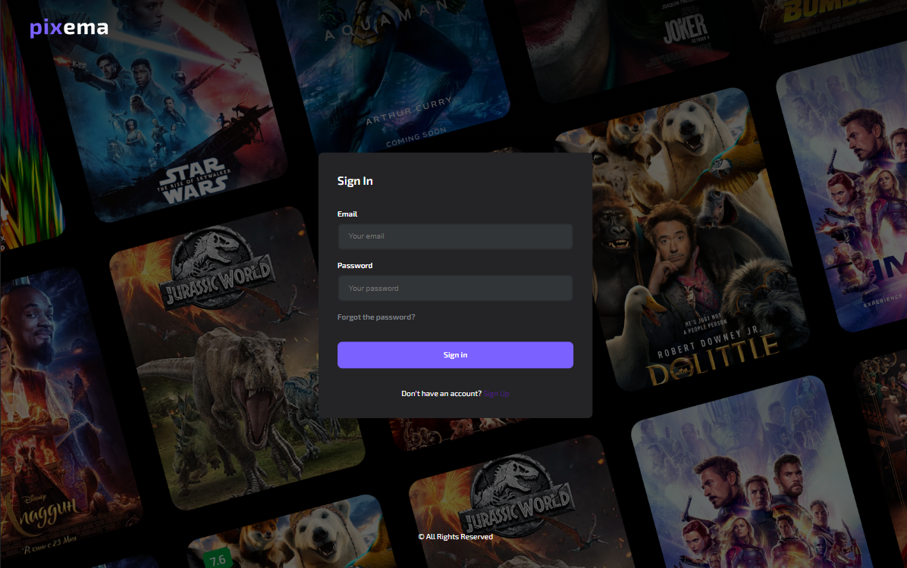

<a name="readme-top"></a>

[![Contributors][contributors-shield]][contributors-url]
[![Forks][forks-shield]][forks-url]
[![Stargazers][stars-shield]][stars-url]
[![Issues][issues-shield]][issues-url]
[![LinkedIn][linkedin-shield]][linkedin-url]

<!-- PROJECT LOGO -->
<div align="center">
<br />
<a href="https://github.com/petrovskya/react-app-pixema">
    
  </a>
   <h3 align="center">PIXEMA</h3>
  <p align="center">
    There are many new films released every year. And in order to find an interesting movie among such a number, this site was created. 
    <br />
    Well, as a graduation project too, ha-ha.
    <br />
    <br />
    <!--  -->
    <a href="https://petrovskya.github.io/react-app-pixema/"> Click here</a> to visit!
    <br />
  </p>
</div>

<!-- ABOUT THE PROJECT -->

## About The Project

Pixema is the final graduation project of the TechMeSkills course in front-end development. There are no online movies on this site. The purpose of this site: to provide an opportunity to decide for yourself with good films, series, anime. It is possible to search for a movie by title and filter by year of release. In order not to lose your favorite movie or series, you can use the user's personal account by going through a simple registration using e-mail. After that, adding to favorites will become available, as well as changing the theme of the site.

### Built With


<!-- GETTING STARTED -->

## Getting Started

To get started use the `npm start`.

### Prerequisites

To install all libraries use the `npm install`.

### Installation

If you want to use the local copy:

1. Clone the repo
   ```sh
   git clone https://github.com/petrovskya/react-app-pixema
   ```
2. Install NPM packages
   ```sh
   npm install
   ```

## Usage

After loading the site, you get to the Home Page.

In the dark mode:


The trending page provides thematic collections of trends for users.


Selecting a movie allows you to view additional information about it.


Registered users can add a movie to favorites. This can be done from the movie page or directly from the list of films.


Favorites Page will have your collection.


The Settings page allows you to modify your personal details such as your name, email.


By switching, you can open an additional field for changing the password.


Additionally, authorized users have the option to customize the user interface by selecting between light and dark modes.


This is how the Sign In page looks like. It is important to note that the favorite movies and settings pages are only available to authorized users.



If you don't have an account, don't worry, we have a registration page.


By opening the filters,


you can search for a movie by title and release year.


Pixema is responsive to different device screens.


 


<!-- CONTACT -->

## Contact

Yana Piatrouskaya
<br />
Email: petrovska.ya@icloud.com
<br />

[![linkedin-shield][linkedin-shield]][linkedin-url]

[![github][github]][github-url]
<br />
Project Link: [https://github.com/petrovskya/react-app-pixema
]

<p align="right">(<a href="#readme-top">back to top</a>)</p>

<!-- MARKDOWN LINKS & IMAGES -->
<!-- https://www.markdownguide.org/basic-syntax/#reference-style-links -->

[contributors-shield]: https://img.shields.io/github/contributors/petrovskya/react-app-pixema.svg?style=for-the-badge
[contributors-url]: https://github.com/petrovskya/react-app-pixema/graphs/contributors
[forks-shield]: https://img.shields.io/github/forks/petrovskya/react-app-pixema.svg?style=for-the-badge
[forks-url]: https://github.com/petrovskya/react-app-pixema/network/members
[stars-shield]: https://img.shields.io/github/stars/petrovskya/react-app-pixema.svg?style=for-the-badge
[stars-url]: https://github.com/petrovskya/react-app-pixema/stargazers
[issues-shield]: https://img.shields.io/github/issues/petrovskya/react-app-pixema.svg?style=for-the-badge
[issues-url]: https://github.com/petrovskya/react-app-pixema/issues
[linkedin-shield]: https://img.shields.io/badge/-LinkedIn-black.svg?style=for-the-badge&logo=linkedin&colorB=555
[linkedin-url]: https://www.linkedin.com/in/petrovskya/
[github]: https://img.shields.io/badge/GitHub-100000?style=for-the-badge&logo=github&logoColor=white
[github-url]: https://github.com/petrovskya
[material-ui-url]: https://mui.com/
[material-ui-shield]: https://img.shields.io/badge/Material--UI-0081CB?style=for-the-badge&logo=material-ui&logoColor=white
[react-router-url]: https://reactrouter.com/en/main
[react-router-shield]: https://img.shields.io/badge/React_Router-CA4245?style=for-the-badge&logo=react-router&logoColor=white
